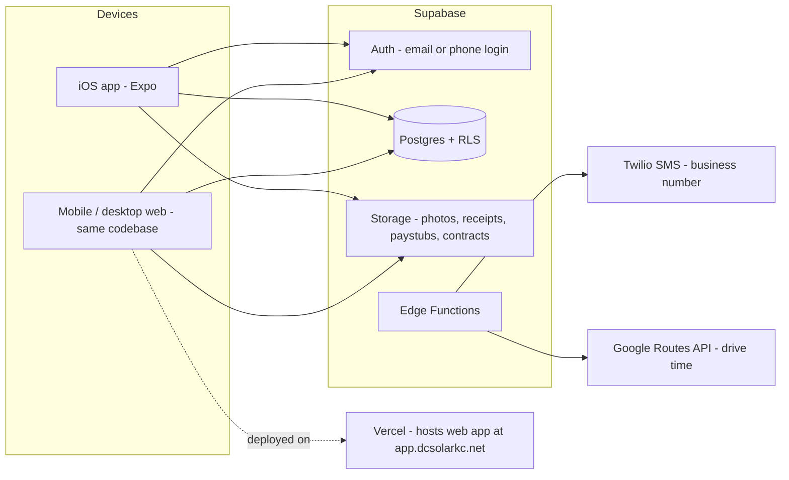

# DC Solar KC — Field Operations App: Build Plan

*Created 2026-07-24 · Owner: Devon (devonsd311@gmail.com) · DC Solar LLC, founded 2026-07-01*
*Website repo: https://github.com/durby48/dcsolarkc (cloned into `website/`)*

## 1. What we're building

One codebase that ships as:
- **An iOS app** (employees: 6 today, all iPhone) — installed via TestFlight, later Unlisted App Store distribution
- **A mobile/desktop web app** (same features + admin dashboard) — hosted on your existing Vercel account
- Android comes nearly free from the same codebase if you ever hire an Android user

**Employee features:** clock in/out (GPS-stamped), schedule + jobsite addresses, per-job photo upload, receipt upload, tool checklist per vehicle (truck + van), inventory, time-off requests, paystubs.

**Owner/admin features:** approve time + time off, manage jobs/schedule, live crew location while on the clock, automated customer ETA texts and review requests from a DC Solar business number, click-to-call/SMS, **a company finance dashboard (P&L per job, labor cost per employee per job, every expense itemized), estimate + invoice generation from the iOS app**, and eventually the full CRM — replacing the home-PC + Cloudflare tunnel setup.

**Existing data to import:** Devon's 3-sheet spreadsheet — (1) P&L per job, (2) hours already paid per employee classified per job, (3) every company expense itemized to date — becomes the seed data for the finance tables.

## 2. Recommended stack (and why)

| Layer | Choice | Why |
|---|---|---|
| App framework | **Expo (React Native) + TypeScript + Expo Router** | One codebase → iOS **and** web. Develop fully from Windows; no Mac required for daily work. This is almost certainly the 30k+-star GitHub project from the TikTok. |
| Backend | **Supabase — the website's existing project** | The website repo already defines tables for `employees`, `customers`, `jobs`, `employee_hours`, `finance_entries`, `quote_requests`, plus an `employee-docs` storage bucket and employee login middleware. The app extends this same schema instead of starting fresh — website leads, ops console, and the app all share one database. |
| Web hosting | **Vercel** (existing account) | Hosts the web build + admin dashboard next to dcsolarkc.net, e.g. `app.dcsolarkc.net`. |
| SMS + business number | **Twilio** | Dedicated DC Solar number for automated ETA texts + review requests. Requires one-time A2P 10DLC registration (needs your EIN). |
| Voice calls | **Native iPhone dialer** (tap-to-call from the app) | Free, zero setup, works day one. Twilio Voice with branded caller ID can come later if you want it. |
| Maps/ETA | **Apple Maps (MapKit) + Google Routes API** for drive-time | Tap an address → opens Apple Maps; server computes ETA from crew location → jobsite for customer texts. |
| iOS builds | **EAS Build (Expo's cloud build service)** | Builds and submits the iOS app to TestFlight **from Windows** — no Mac needed. Uses your existing Apple Developer account. |
| Payroll/paystubs | **PDF upload (start)** → revisit Gusto API later | You're on Chase Payment Solutions *powered by* Gusto (embedded), which likely doesn't expose the API to you directly. With 6 employees and 2 payrolls ever, uploading stub PDFs takes you ~2 min/payroll and employees view them securely in-app. If you migrate to direct Gusto later, we can integrate properly. |

## 3. Architecture

Everything lives in Supabase — nothing depends on your home PC being on. The Cloudflare-tunnel CRM gets migrated in Phase 4 and then retired.

## 4. Data model (core tables)

- `profiles` — employee, role (admin/field), phone, linked to Supabase auth user
- `customers` — name, address, phone, email (imported from CRM)
- `jobs` — customer, site address + lat/lng, status, scheduled window, assigned crew
- `job_assignments` — employee ↔ job ↔ date
- `time_entries` — clock in/out timestamps, GPS coords + accuracy at each punch, job link, admin-edited flag
- `location_pings` — employee, lat/lng, timestamp (only recorded while clocked in)
- `job_photos` / `receipts` — storage path, job/expense link, uploader, timestamp
- `time_off_requests` — dates, type, status, reviewed-by
- `paystubs` — employee, pay period, storage path (RLS: employee sees only their own)
- `inventory_items` + `inventory_transactions` — solar materials, qty on hand, check-out to job / return / used
- `vehicles` (truck, van) + `tool_checklist_items` + `checklist_runs` — daily per-vehicle checklist with who/when
- `sms_log` — every automated text (ETA, review request), recipient, Twilio status

**Finance tables** (seeded from the 3-sheet spreadsheet, owner-only via RLS):
- `expenses` — date, vendor, amount, category, job link (nullable = overhead), receipt link
- `labor_payments` — employee, job, hours, amount paid (imported history; going forward derived from `time_entries` × pay rate)
- `estimates` / `invoices` — customer, job, line items, status (draft/sent/accepted/paid), generated PDF path
- `invoice_line_items` / `estimate_line_items` — description, qty, unit price
- `payments` — invoice link, date, amount, method
- **P&L per job is computed, not stored:** invoice revenue − (materials expenses + labor + allocated overhead), matching the spreadsheet's per-job view
- Phase 5 adds: `contracts` and remaining CRM history

Row Level Security enforces: field employees see their own punches/stubs/requests and assigned jobs; admins see everything.

## 5. Phases

### Phase 0 — Foundation (get the skeleton running)
Repo + Expo app + Supabase project, schema above, login (invite your 6 employees), role-based navigation, DC Solar branding (your artwork). **Testable in the iOS simulator / Expo Go on day one.**

### Phase 1 — Daily-driver MVP → TestFlight
- Clock in/out with GPS stamp (flags punches far from the assigned jobsite)
- Today/week schedule; job detail with address → tap to open Apple Maps
- Photo upload per job (camera or library, auto-tagged to job + uploader)
- Receipt upload (same pattern, tagged to job or general expense)
- Time-off requests + admin approve/deny
- Admin: timesheet view/edit + CSV export (this is what you'll enter into Chase/Gusto payroll)
- **Ship to TestFlight via EAS** — your crew installs it on their iPhones

### Phase 2 — Operations
- Inventory: items, quantities, check out to job / mark used / return
- Tool checklists for the truck and the van (daily run, missing-tool flags)
- Paystubs: you upload PDFs, employees view their own
- Web admin dashboard polished and deployed to `app.dcsolarkc.net`

### Phase 3 — Finance
- Import the 3-sheet spreadsheet (P&L per job, labor paid per employee per job, itemized expenses) into the finance tables — one-time script, verified against the spreadsheet totals
- **Owner finance dashboard** (owner login only): company P&L, P&L per job, labor cost per employee per job, expense breakdown by category, cash collected vs outstanding invoices
- **Estimates & invoices from the iOS app**: pick customer + line items → branded PDF → send to customer by email or text link → track sent/accepted/paid; record payments against invoices
- New expenses flow straight in from the receipt-upload feature (Phase 1) with category + job tagging

### Phase 4 — Location + customer comms
- Background location **only while clocked in** (auto-stops at clock-out)
- Twilio number + A2P 10DLC registration (start this early — approval can take days to a couple of weeks; EIN on file: 93-3073873 — Devon enters it into Twilio's forms directly)
- "On our way" flow: tech taps → server computes drive time → customer gets a branded ETA text
- Job-complete flow → automatic Google-review request text
- Click-to-call and prefilled SMS from every customer/job screen
- Live crew map for you

### Phase 5 — CRM migration (kill the home-PC dependency)
- Import the Opus-4.8-built CRM's remaining data (contracts, historical estimates/invoices, documents) into Supabase; files into Storage
- Rebuild the CRM screens in the web admin (and the parts useful in the field into the iOS app)
- Retire the Cloudflare tunnel

## 6. Location tracking — doing it right

- **On-the-clock only.** Tracking starts at clock-in, hard-stops at clock-out. Never off-shift. This is both the legal/ethical baseline and what Apple's review expects.
- Have each employee sign a one-page location-tracking consent/policy (I can draft it). Missouri/Kansas allow employer tracking of work activity with notice; consent removes all doubt.
- iOS: "Always" location permission + background-location entitlement; App Store review will ask why — the clock-in/dispatch use case is a well-accepted answer, and TestFlight distribution (Phases 1–3) has lighter review anyway.
- Battery: ping every ~2–5 min or on significant movement, not continuous GPS.

## 7. Costs (monthly, roughly)

| Item | Cost |
|---|---|
| Apple Developer | already paid ($99/yr) |
| Supabase | $0 now → $25/mo when you outgrow free tier |
| Vercel | $0 (existing) |
| Twilio number + A2P + SMS | ~$5–15/mo at your volume; one-time registration fees ~$20–50 |
| EAS Build | $0 (free tier) → $19/mo if you build very frequently |
| Google Routes API | ~$0 at your volume (free credit covers it) |

**Total: roughly $5–60/mo.**

## 8. How you'll develop and test (Windows-first, "inside Claude")

- **From Windows:** Claude Code runs the Expo dev server; you scan a QR code with the **Expo Go** app on your own iPhone and the live app appears there, hot-reloading as code changes. The web version previews right in Claude Code's browser pane.
- **On a Mac (like today):** Claude Code can build, launch, and *drive* the app in the iOS Simulator in a live panel — tapping through screens, screenshotting, verifying flows itself.
- **Shipping:** `eas build` + `eas submit` push signed builds to TestFlight from any OS. No Mac ever required for releases.

## 9. What I need from you (when convenient)

1. ~~GitHub repo~~ ✅ received: https://github.com/durby48/dcsolarkc
2. ~~EIN~~ ✅ on file: 93-3073873 (for Twilio A2P in Phase 4)
3. **The 3-sheet finance spreadsheet** (P&L per job, labor per employee per job, itemized expenses) — drop the .xlsx into this project folder for the Phase 3 import
4. Artwork/logo files for app icon + splash (or I'll pull from the website's public/ assets)
5. Supabase access: either invite Claude-usable credentials or run the schema SQL I generate in your Supabase dashboard
6. The CRM's code/data export (Phase 5 — from your home PC, no rush)
7. Employee names + emails/phones for invites

## 10. Website repo findings (2026-07-24 review)

- **Two apps in one repo**: the public marketing page, plus an auth-gated `/operations` back-office console (finance, jobs, hours, Gmail/Google Calendar integration, encrypted HR records vault). There's also a prebuilt React-Native-web ops bundle checked into `public/ops-client/`.
- **Branding to reuse in the app**: cream `#FFF3E6` background, sun `#FFB066` primary buttons, ocean `#5AA8CF` links/accents, sky `#9FD6F2`, ink `#3D352E` text; fonts Inter (body) + Sora (headings); logo at `website/public/logo.png` (KC skyline wordmark), sun icon at `website/public/icon.svg`.
- **Already built and reusable**: Resend email sending, Google Calendar + Gmail service-account integration, quote-request lead capture into `quote_requests` (notifies devon@dcsolarkc.com).
- ~~Domain discrepancy~~ ✅ resolved: Devon confirmed the live domain is **dcsolarkc.com** — the site code is already correct.
- **The Supabase project is live and populated** (https://kjamxfezsathrsbztiln.supabase.co): 14 jobs (matching the spreadsheet), 10 customers, 36 finance entries, 7 employee-hours rows, 2 employee logins. The spreadsheet import is therefore a *reconciliation* (fill gaps, don't duplicate) — see `data/reconciliation-report.md`.

## 11. Risks & notes

- A2P SMS registration lead time → we start the paperwork in Phase 2 so it's approved by Phase 3.
- Photo storage grows fast — we'll compress on upload and can archive old jobs to cheap storage later.
- The paystub answer may improve: if you move from Chase-embedded Gusto to direct Gusto, employees also get the Gusto Wallet app and we can API-sync. Not worth blocking on.
- Keep the Cloudflare-tunnel CRM read-only once migration starts, so data doesn't fork.
